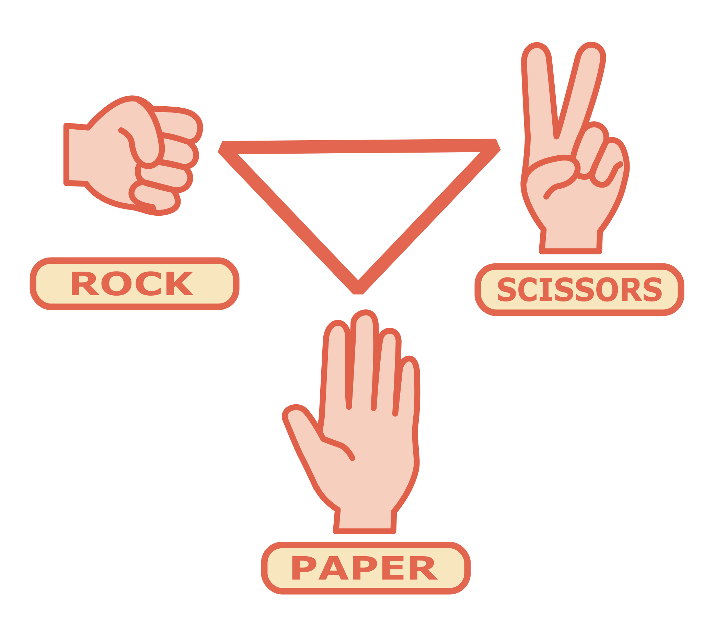

# Rock, Paper, Scissors ***Shoot***!
- Developer: [David M. O'Mullan](https://github.com/davidomullan)
- Guidelines: [The Odin Project](https://www.theodinproject.com/lessons/foundations-rock-paper-scissors)

## Implementation
Currently played through simple button GUI. Winner announced through alert.

## Rules
1. Player chooses either: Rock, Paper, or Scissors
2. Computer randomly chooses: Rock, Paper, or Scissors
3. Rock beats Scissors, Scissors beats Paper, Paper beats Rock
4. Matching selections are a draw, no points!
4. First to five points wins!

